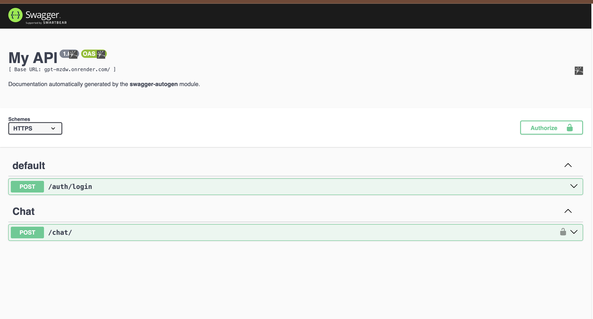

# Node GPT

I logged in with a firebase anonymous account and enabled the user to interact with chatgpt.


## Installation

In summary, download and install the project in 3 steps

```bash
  npm install
  npm run swagger-autogen
  node index.js
```

## Run it on your computer

Clone the project

```bash
  git clone https://link-to-project
```

Go directory the project

```bash
  cd my-project
```

Separating env file from example

```bash
  cp .env.example
```

Install need package

```bash
  npm install
```

Swagger run
```bash
  npm run swagger-autogen
```

Project run

```bash
  npm start
```
http://localhost:3000/doc


## Demo

https://gpt-mzdw.onrender.com/doc




## Feedback

If you have any feedback, please contact us at eyupinan08@gmail.com


## Lisans


[MIT](https://choosealicense.com/licenses/mit/)
